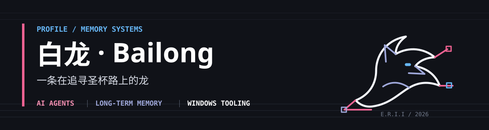

  

   

  <b>让 Agent 记得走过的路，也让工具安静地解决问题。</b>

  
AI Agents · 长期记忆 · RAG · Windows 系统工具

  

    
    
    
  

## 正在构建

我正在开发 [**E.R.I.I**](https://github.com/bailong-Hakuryu/E.R.I.I)：面向 LLM Agent 的双轨长期记忆引擎。它关注的不只是“存下对话”，而是让记忆能够形成、巩固、检索，并在后续任务中真正发挥作用。

- **主线方向：** Agent memory、RAG、记忆评估与可观测性
- **工程偏好：** 清晰的边界、可验证的行为、能长期维护的工具
- **常用环境：** Python、C++、PowerShell、Windows
- **语言：** 中文 / English

> 圣杯不是杯子，是会被记住的记忆。

## 项目

| 项目 | 解决的问题 | 技术方向 |
| --- | --- | --- |
| [**E.R.I.I**](https://github.com/bailong-Hakuryu/E.R.I.I) | 为 LLM Agent 构建可演化的双轨长期记忆 | Python · LLM · RAG |
| [**UpdateLock**](https://github.com/bailong-Hakuryu/UpdateLock) | 控制 Windows 软件的非预期自动更新 | C++ · Windows · ACL |
| [**KouriChat**](https://github.com/bailong-Hakuryu/KouriChat) | 探索基于 LLM 的角色交互与长期陪伴 | Python · LLM · Character AI |

## 技术方向

  
  
  
  
  
  
  
  

    

  <picture>
    <source media="(prefers-color-scheme: dark)" srcset="https://skillicons.dev/icons?i=python,cpp,powershell,git,github,vscode&theme=dark&perline=6"/>
    
  </picture>

## GitHub 动态

  <picture>
    <source media="(prefers-color-scheme: dark)" srcset="https://raw.githubusercontent.com/bailong-Hakuryu/bailong-Hakuryu/main/metrics-dark.svg"/>
    
  </picture>

  
统计卡片由 <a href="https://github.com/lowlighter/metrics">lowlighter/metrics</a> 每日生成。

## 贡献记录

  <picture>
    <source media="(prefers-color-scheme: dark)" srcset="https://raw.githubusercontent.com/bailong-Hakuryu/bailong-Hakuryu/output/github-contribution-grid-snake-dark.svg"/>
    
  </picture>

---

  
  
    
  白龙 · Bailong · Building memory for agents

