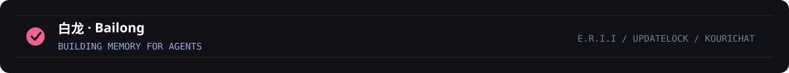

  

    

  <h1>白龙 · Bailong</h1>

  <b>让 Agent 记得走过的路，也让工具安静地解决问题。</b>

  

    
    
    
  

## Character File / 角色档案

<table>
  <tr>
    <td width="60%" valign="top">
      <h3>Current Quest / 当前主线</h3>
      
正在开发 <a href="https://github.com/bailong-Hakuryu/E.R.I.I"><b>E.R.I.I</b></a>：面向 LLM Agent 的双轨长期记忆引擎。它不只保存对话，还让记忆能够形成、巩固、检索，并在后续任务中真正发挥作用。

      <blockquote>圣杯不是杯子，是会被记住的记忆。</blockquote>
      

        <code>CLASS</code> Memory Engineer 
        <code>FOCUS</code> Agent Memory · RAG · Evaluation 
        <code>GEAR</code> Python · C++ · PowerShell 
        <code>BASE</code> Windows · 中文 / English
      

    </td>
    <td width="40%" align="center" valign="top">
      
      
感谢 <b>Nachoneko</b> 的陪伴与启发 ♡

    </td>
  </tr>
</table>

## Quest Log / 项目

<table>
  <tr>
    <td width="22%" valign="top"><b>MAIN QUEST</b> <code>E.R.I.I</code></td>
    <td width="78%" valign="top">
      <b><a href="https://github.com/bailong-Hakuryu/E.R.I.I">双轨长期记忆引擎</a></b> 
      为 LLM Agent 构建可形成、巩固与检索的长期记忆。 
      <code>Python</code> <code>LLM</code> <code>RAG</code>
    </td>
  </tr>
  <tr>
    <td width="22%" valign="top"><b>GUARD QUEST</b> <code>UpdateLock</code></td>
    <td width="78%" valign="top">
      <b><a href="https://github.com/bailong-Hakuryu/UpdateLock">Windows 更新守卫</a></b> 
      控制 Windows 软件的非预期自动更新。 
      <code>C++</code> <code>Windows</code> <code>ACL</code>
    </td>
  </tr>
  <tr>
    <td width="22%" valign="top"><b>STORY QUEST</b> <code>KouriChat</code></td>
    <td width="78%" valign="top">
      <b><a href="https://github.com/bailong-Hakuryu/KouriChat">角色交互与长期陪伴</a></b> 
      探索基于 LLM 的长期角色关系。 
      <code>Python</code> <code>LLM</code> <code>Character AI</code>
    </td>
  </tr>
</table>

## Equipment / 技术栈

  
  
  
  
  
  
  
  

    

  <picture>
    <source media="(prefers-color-scheme: dark)" srcset="https://skillicons.dev/icons?i=python,cpp,powershell,git,github,vscode&theme=dark&perline=6"/>
    
  </picture>

## Adventure Record / GitHub 动态

  <picture>
    <source media="(prefers-color-scheme: dark)" srcset="https://raw.githubusercontent.com/bailong-Hakuryu/bailong-Hakuryu/main/metrics-dark.svg"/>
    
  </picture>

  
由 <a href="https://github.com/lowlighter/metrics">lowlighter/metrics</a> 每日记录。

  <picture>
    <source media="(prefers-color-scheme: dark)" srcset="https://raw.githubusercontent.com/bailong-Hakuryu/bailong-Hakuryu/output/github-contribution-grid-snake-dark.svg"/>
    
  </picture>

---

  
    
  

